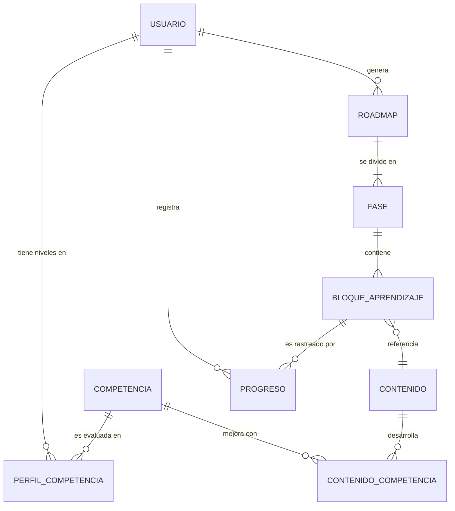

# Arquitectura de Datos y Esquema de Entidades

Para el MVP de **Gemelo Cognitivo de Aprendizaje**, la arquitectura de datos se ha diseñado priorizando la **simplicidad técnica, la claridad pedagógica y la facilidad de ajuste**. Dado que el sistema utiliza Agentes (perfilado, planificación y explicativo) respaldados por reglas pedagógicas y LLMs, los datos estructurados sirven como el "estado" sobre el cual los agentes razonan.

Se propone una base de datos relacional (por ejemplo, **PostgreSQL**) que permite estructurar el modelo de competencias y la relación con los contenidos formativos.

---

## 🏗️ Esquema de Entidades

A continuación se detalla el esquema principal de las 5 entidades solicitadas:

### 1. Usuario (`User`)
Representa tanto a los clientes (estudiantes/profesionales) como a los administradores.
- `id` (UUID): Identificador único.
- `nombre` (String): Nombre del usuario.
- `email` (String): Correo electrónico (único).
- `rol_sistema` (Enum): `ADMIN`, `USER`.
- `rol_profesional_actual` (String): Ej. "Desarrollador Junior".
- `nivel_experiencia` (Enum): `JUNIOR`, `MID`, `SENIOR`.
- `objetivo_profesional` (String): Ej. "Convertirse en Tech Lead".
- `fecha_registro` (Timestamp).

### 2. Competencia (`Competency`)
Es el elemento central del **Gemelo Cognitivo**. Cada usuario tiene un nivel actual y un nivel objetivo.
- `id` (UUID): Identificador único.
- `nombre` (String): Ej. "Programación en Python", "Liderazgo".
- `categoria` (Enum): `HARD_SKILL`, `SOFT_SKILL`.
- `descripcion` (Text): Qué implica esta competencia.
- `estado_gemelo_usuario` (Relación NxM con Usuario):
  - `usuario_id`
  - `competencia_id`
  - `nivel_actual` (Integer 1-5 o Enum: Básico, Intermedio, Avanzado)
  - `nivel_objetivo` (Integer 1-5)

### 3. Contenido (`Content`)
Representa el catálogo formativo limitado configurado por el administrador.
- `id` (UUID): Identificador.
- `titulo` (String): Nombre de la formación (ej. "Curso de Arquitectura Limpia").
- `descripcion` (Text): Resumen del contenido.
- `tipo` (Enum): `CURSO`, `ARTICULO`, `TALLER`.
- `duracion_horas` (Integer).
- `competencias_asociadas` (Relación NxM con Competencia):
  - `contenido_id`
  - `competencia_id`
  - `impacto` (Integer: Puntos de mejora que aporta a la competencia).

### 4. Roadmap (`Roadmap`)
El plan de formación estructurado generado por el Agente de Planificación Formativa.
- `id` (UUID): Identificador del roadmap.
- `usuario_id` (UUID - FK): Dueño del roadmap.
- `fecha_generacion` (Timestamp).
- `estado` (Enum): `ACTIVO`, `HISTORICO`.
- `enfoque` (Enum): Ej. `GENERALISTA`, `ESPECIALISTA` (para manejar las dos trayectorias alternativas).

**Estructura Interna del Roadmap (Fases y Bloques):**
- `FaseRoadmap`: Divide el roadmap en etapas (ej. Fase 1: Fundamentos).
  - `roadmap_id`, `orden`, `titulo`, `objetivo_fase`
- `BloqueAprendizaje`: Ítem formativo dentro de una fase.
  - `fase_id`, `contenido_id` (FK a Contenido), `orden`
  - `justificacion_pedagogica` (Text): **Generado por el Agente Explicativo** para justificar por qué se recomienda.

### 5. Progreso (`Progress`)
Sistema para el seguimiento manual por parte del usuario.
- `id` (UUID)
- `usuario_id` (UUID - FK)
- `bloque_aprendizaje_id` (UUID - FK)
- `estado` (Enum): `PENDIENTE`, `EN_CURSO`, `COMPLETADO`.
- `fecha_completado` (Timestamp - Nullable).

---

## 📊 Diagrama Lógico Relacional (Simplificado)



## Entorno y Persistencia

- **Base de Datos Principal:** PostgreSQL. Es robusta, soporta esquema relacional rígido (ideal para reglas pedagógicas claras) y tiene capacidad JSONB si en el futuro se requieren logs de los agentes.
- **ORM:** SQLAlchemy (Python) o Prisma (Node.js) para manejar el acceso a datos.
- **Migraciones:** Alembic (si es Python) o el CLI de Prisma, lo que facilita que los 4 miembros del equipo mantengan la base de base de datos sincronizada.

---
---

# Setup del Proyecto y Entornos

Para facilitar el trabajo en equipo (4 personas) durante el mes de desarrollo y asegurar que el entorno sea replicable, se utilizará **Docker** y **Docker Compose**. Esto garantiza que tanto frontend como backend y la base de datos se ejecuten consistente en todos los equipos.

## 📂 Estructura de Carpetas Sugerida

El repositorio del MVP debería estructurarse de la siguiente manera:

```text
GemeloDigital/
├── backend/                  # API y lógica de los agentes
│   ├── app/                  # Lógica de negocio (routers, schemas, models)
│   ├── agents/               # Scripts de los 3 agentes (Perfilado, Planificador, Explicativo)
│   ├── core/                 # Configuración (variables de entorno, db_session)
│   ├── requirements.txt      # Dependencias de Python
│   └── Dockerfile            # Configuración Docker para Backend
├── frontend/                 # Interfaz de usuario (MVP interactivo)
│   ├── src/                  # Componentes y páginas
│   ├── package.json          # Dependencias Node.js
│   └── Dockerfile            # Configuración Docker para Frontend
├── database/
│   └── init/                 # Scripts SQL para inicializar DB (01_schema.sql)
├── docs/                     # Documentación (arquitectura, reglas pedagógicas)
├── docker-compose.yml        # Orquestación de contenedores
├── .gitignore                # Reglas de exclusión de Git
└── README.md                 # Guía de despliegue rápido
```

## 🐳 Entorno de Desarrollo Compartido (Docker)

El archivo **`docker-compose.yml`** configura 3 servicios esenciales:
1. **db**: Instancia de PostgreSQL para persistir el gemelo cognitivo y catálogo.
2. **api**: El backend (ej. Python/FastAPI) encargado de la lógica y la conexión con modelos de IA.
3. **web**: El frontend (ej. Next.js/React/Vite) que consume la API.

*(Se han generado los archivos base en tu carpeta de proyecto para levantar el entorno de inmediato).*

### ¿Cómo inicializarlo?

Simplemente ejecutando el siguiente comando en la raíz del proyecto (`GemeloDigital`):

```bash
docker-compose up --build
```
Esto levantará:
- El Frontend en `http://localhost:3000`
- El Backend (API) en `http://localhost:8000`
- La Base de Datos PostgreSQL en el puerto `5432`
